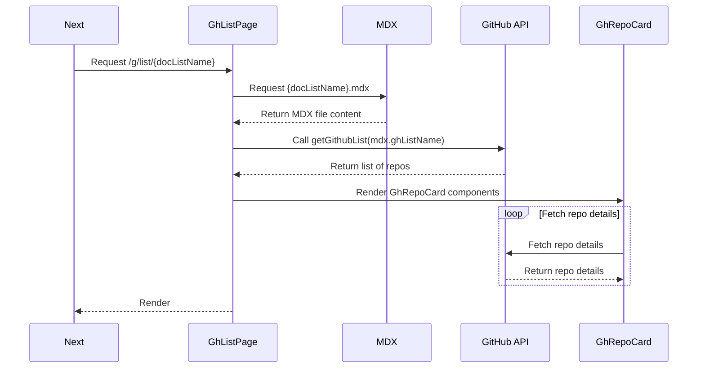

# GitHub Lists Bookmark Manager

## Features

-   **MDX Driven Lists:** Create and manage lists of GitHub repositories using MDX files for content and GitHub Lists.
-   **List Management:** Organize your repository lists on GitHub.com using stars and starred list collections.
-   **Dynamic Data Fetching:** Automatically fetch and display data about repositories using the GitHub API.

## How It Works

### Required Environment Variables

To run this project, you need to set the following environment variables:

-   `GITHUB_USER`: Your GitHub username. This is required to know where to query the lists.
-   `GITHUB_PAT`: Your GitHub Personal Access Token. This token is used to load repository details for each list bookmark. Refer to [GitHub's documentation](https://docs.github.com/en/authentication/keeping-your-account-and-data-secure/managing-your-personal-access-tokens) for more information on how to create a personal access token.

### GitHub Lists as Bookmarks

GitHub Lists enhance the starring experience by allowing you to organize and curate your favorite repositories. These lists can serve as bookmarks, which you can then query by their name using the `ghListName` identifier.

### Creating and Managing GitHub Lists

1. **Creating a List:**

    - Click your profile photo in the upper-right corner of any GitHub page, then click "Your stars".
    - Next to "Lists", click "Create list".
    - Enter a name and description for your list and click "Create".

2. **Adding a Repository to a List:**
    - Click your profile photo in the upper-right corner of any GitHub page, then click "Your stars".
    - Find the repository you want to add using the search bar.
    - Next to the repository, use the "Starred" dropdown menu to select your list.

By leveraging GitHub Lists, you can effectively bookmark repositories and query them by their list name (`ghListName`) to fetch and display data dynamically.

For more details, refer to GitHub's [documentation on Lists](https://docs.github.com/en).

Unfortunately, there is no official API to load the lists, so we have to resort to some creative hackery to fetch the lists :)

### Application Workflow

#### 1. Curating Lists in MDX

Create MDX files in the `content/g-github-lists` directory to define your lists of GitHub repositories. Each MDX file represents a list on your GitHub profile and includes metadata and descriptions.

#### 2. Fetching Repository Data

The application uses the `ghListName` from the MDX file to fetch repository data from the GitHub API. The fetched data is used to render the list of repositories dynamically.

Example MDX file:

```mdx
---
title: Awesome Next.js
desc: Websites built with Next.js
ghListName: d5-nextjs
---
```

### Rendering a List



**Route:**

```
/g/list/{docListName}
```

**Internal Workflow:**

1. **Routing to GhListPage Component:**

    - When a request is made to `/g/list/{docListName}`, the `GhListPage` component is routed to handle the request.

2. **Fetching the MDX Page:**

    - The `GhListPage` component loads the corresponding MDX file for the given `{docListName}` from the path: `content/g-github-lists/{docListName}.mdx`

3. **Extracting Page Metadata:**

    - The component extracts the `ghListName` from the MDX file's metadata.

4. **Fetching GitHub Lists Data:**

    - Using the extracted `ghListName`, the component calls the `getGithubList(ghListName)` function to fetch the full list of repositories associated with this list ID from the GitHub API.

5. **Displaying the List:**
    - The fetched repository data is then used to render the list of `GhRepoCard` components, which individually call GitHub API Repository endpoints to load more details.

### Project Structure

```
github-lists
├── content
│   ├── g-github-lists
│   │   ├── awesome-nextjs.mdx
│   └── p-pages
│       ├── about.mdx
└── src
    └── app
        ├── _components
        ├── (pages)
        │   ├── g
        │   │   └── list [docListName]
        │   │       ├── page.tsx
        │   ├── layout.tsx
        │   ├── page.tsx
        │   └── p [...slug]
        │       └── page.tsx
        ├── layout.tsx
        └── page.tsx
        └── domain\components
            ├── GhListRepoCount.tsx
            └── GhRepoCard.tsx
├── contentlayer.config.ts
├── next.config.js
└── package.json
```
