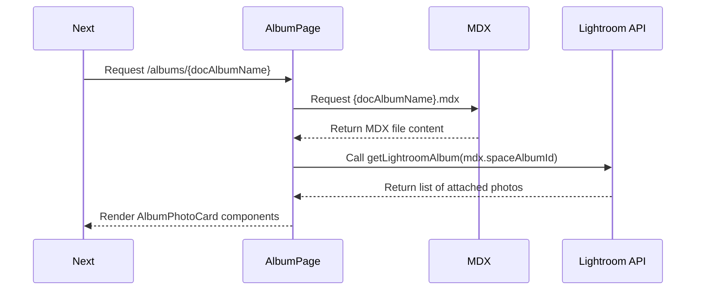

# Insta-LR (Instagram Clone using Adobe Lightroom Albums)

## Features

-   **MDX Driven Albums:** Create and manage photo albums using MDX files for content and the Lightroom Share Endpoints.
-   **Album Management in Lightroom:** Render your photo albums fetched from the Lightroom Share Endpoints.
-   **Dynamic Data Fetching:** Automatically fetch and display data about photo albums using Lightrooms (inofficial) Share API.

## How It Works

### Required Environment Variables

To run this project, you need to set the following environment variables:

TODO

### Lightroom Share Endpoints for Photo Albums

The Lightroom Share Endpoints allows you to organize and curate your photo albums. These albums can serve as collections, which you can then query by their name using the `spaceAlbumId` identifier.

### Creating and Managing Photo Albums

1. **Creating an Album:**

    - Use the Lightroom application to create a new album and add your photos.
    - Share the album to generate a public link and retrieve the album's ID from the Lightroom Share Endpoints.

2. **Fetching Album Data:**
    - Use the album ID to query the Lightroom Share Endpoints and fetch album details and photos.

### Application Workflow

#### 1. Curating Albums in MDX

Create MDX files in the `content/a-albums` directory to define your photo albums. Each MDX file represents an album on your Lightroom account.

#### 2. Fetching Album Data

The application uses the `spaceAlbumId` from the MDX file to fetch album data from the Lightroom Share Endpoints.

Example MDX file:

```mdx
---
title: Switzerland Trip
desc: Photos from my trip to Switzerland
spaceAlbumId: 0b1e369a0954462585ca49f881258aab.bd5e970f774343f9ae9f9e56f2cfd273
---
```

### Rendering an Album



**Route:**

```
/albums/{docAlbumName}
```

**Internal Workflow:**

1. **Routing to AlbumPage Component:**

    - When a request is made to `/albums/{docAlbumName}`, the `AlbumPage` component is routed to handle the request.

2. **Fetching the MDX Page:**

    - The `AlbumPage` component loads the corresponding MDX file for the given `{docAlbumName}` from the path: `content/a-albums/{docAlbumName}.mdx`

3. **Extracting Page Metadata:**

    - The component extracts the `spaceAlbumId` from the MDX file's metadata.

4. **Fetching Lightroom Album Data:**

    - Using the extracted `spaceAlbumId`, the component calls the `getLightroomAlbum(albumName)` function to fetch the full list of photos associated with this album ID from the Lightroom Share Endpoints.

5. **Displaying the Album:**
    - The fetched photo data is then used to render the list of `AlbumPhotoCard` components, which individually call Lightroom API endpoints to load more details.

### Project Structure

```
insta-lr
├── content
│   ├── a-albums
│   │   ├── air-shows.mdx
│   │   ├── switzerland.mdx
│   │   ├── moments.mdx
│   │   ├── roads.mdx
│   │   └── window-view.mdx
│   ├── p-pages
│   └── v-vids
├── src
│   ├── app
│   │   ├── _components
│   │   └── (pages)
│   │       ├── albums
│   │       │   ├── [...slug]
│   │       │   │   └── page.tsx
│   │       │   ├── layout.tsx
│   │       │   └── page.tsx
│   │       ├── explore
│   │       ├── p
│   │       ├── vids
│   │       ├── layout.tsx
│   │       └── page.tsx
│   ├── domain
│   │   ├── components
│   │   │   ├── AlbumImage
│   │   │   │   ├── utils-cloudflare-image-loader
│   │   │   │   ├── AlbumImageDebug.tsx
│   │   │   │   └── index.tsx
│   ├── lib
│   │   ├── lightroom-api.ts
├── contentlayer.config.ts
├── next.config.js
└── package.json
```

---
